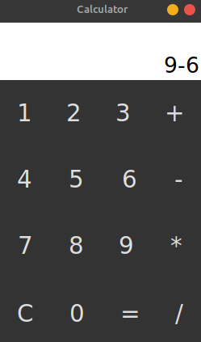

# Calculator-In-Python

<h1>Requirements</h1>

>[Python](https://www.python.org/)  
[Tkinter](https://docs.python.org/3/library/tkinter.html)  
[Visual Studio Code](https://code.visualstudio.com/) or any other code editor  
[Git](https://git-scm.com/downloads)

<h1>How To Use</h1>

- Please Ensure That You Have Installed Python & Tkinter On Your Device.

- Now Open Your Terminal And Type `python3 app.py` To Start The Calculator Application On Your PC.

<h1>Output</h1>

<h2>Discord Server</h2>

[Join our discord server now to get additional support or hang out!](https://discord.gg/QGf3q7e3J5)

<h3>Developer</h3>

👤 anmol420.
- GitHub: [anmol420](https://www.github.com/anmol420)
- Discord: [Anmol](https://www.discord.com/users/875986400649052191)

<h3>Contributing</h3>

- Contributions, issues and feature requests are always needed and welcome!

<h3>Support</h3>

You can show your support by giving a ⭐ if you find some help!

<h3>License</h3>

Copyright © 2022 anmol420 
This project is [MIT](https://en.wikipedia.org/wiki/MIT_License) Licensed.
